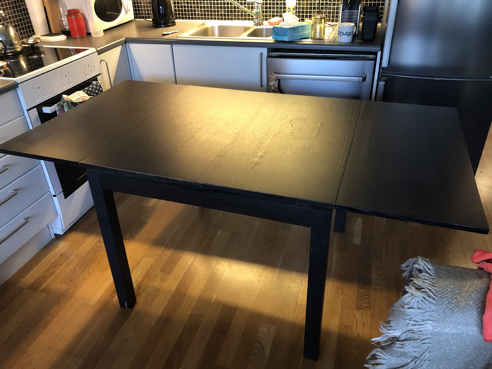

We're leaving Norway and that means EVERYTHING MUST GO!

<iframe width="560" height="315" src="https://www.youtube.com/embed/ZEwmEFN_mlU" frameborder="0" allow="accelerometer; autoplay; encrypted-media; gyroscope; picture-in-picture" allowfullscreen></iframe>

Here's a list of stuff that MUST GO BEFORE 1/1/2019!

Let me know if there's anything you want---save it from the recycling centre!

Ideal day to pick stuff up is Sunday 31/3/2019.

## Furniture

### Corner sofa bed (Ikea) 2011? -- Free

Pretty cool corner sofa that turns into a bed, got off some Icelandic friends when they were leaving Oslo, let's continue the circle of couch giving!

You can put the corner on either side. Comes with sheet / duvet / pillows! WOW!

It's pretty faded and a bit coffee stained, but is still comfy, cleanish, and convenient for hosting guests.

Comes apart into small bits, so can fit in a car. Probably. Maybe two trips?

<!-- ### Hemnes bedside tables (Ikea) -- 2016 -- 100Kr each

- H: 70
- W: 46
- D: 35 -->

<!-- ### Micke Desk (Ikea) -- 2016 -- 150Kr

Nice small desk for small space. In pretty good shape, but some subtle damage to top surface.

- H: 75
- W: 73
- D: 50 -->

### Hemnes chest of drawers (Ikea) -- 2017 -- 200Kr

Nice small chest of drawers. Would take, but might not survive international move...

- H: 95
- W: 107.5
- D: 49.5

### Table (Ikea ?) -- 2007ish -- Free

Table with two expanding leaves

- H: 74
- W: 90
- W open: each leaf adds 39
- D: 90

<!-- ### 3 Chairs (Ikea) --- 2007ish -- Free

Pretty ok looking black Ikea chairs with white upholstery. I cleaned the upholstery one time and it made them much nicer looking.

### Outdoor furniture set (Ikea ÄPPLARÖ) -- 2 chairs, one low table, pillows (600kr)

Nice little furniture set for balconies. Table had snow on it, so needs oil (d'oh), chairs in good shape.

 -->

## Appliances

### Hairdryer -- 100kr

Proper photo to come.

### Microwave -- 100kr 

Bought off finn from somebody for 400kr in 2016. Makes food hot. Makes ice not.  800W, nice and small.

### Vacuum Cleaner (Miele Complete C3 Ecoline, 2016 in _red_) -- 1000kr

Proper photo to come.

### Kettle -- 50kr

<!-- ### Sewing Machine -- maybe taken.
 -->
### Humidifier -- 100kr

Proper photo to come.

### Lots of plug boards -- Free

Some of these are pretty nice! Switches and stuff - cool!

### Lamps -- Free

- 2x Ikea LED clip lamps (black)
- 3x Ikea LED stand lamps (gold)
- combo up- and reading-light (Ikea)

## Other Stuff

### Clothes drying rack -- free

Ikea wire drying rack. Takes wet clothes and makes them dry with the magic of time!

